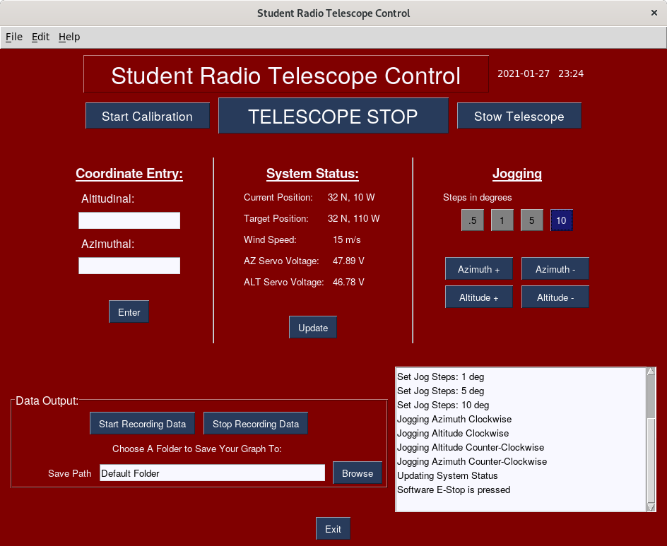

# SRT-GUI

This is the GUI for the Student Radio Telescope at the Steward Observatory, University of Arizona.

A video that describes this project in-depth can be found on YouTube: https://youtu.be/U9ng6gX492w

# Requirement

- Python3 and up

- Python module: PySimpleGUI, PySerial

- Arduino IDE (for uploading the progarm, avrdude can be used)

# Screenshot

# GUI Demostration
Demo available on YouTube: https://youtu.be/IIpRjX_-SAg

